# 🛡️ Đại Cương Kiến Trúc: Tự Động Hóa Bảo Mật (OIDC & AppRole)

Tài liệu này trình bày luồng hoạt động (Workflow), phân tích các phương án kết nối Jenkins-Vault, đào sâu về OIDC và cơ chế bảo mật `bound_claims`.

---

## 🏗️ 1. Luồng Hoạt Động Cốt Lõi (Architecture Flow)


1.  **Dev Push Code:** Developer thực hiện push code lên GitHub.
2.  **HCP Cloud Action:** HCP Terraform nhận tín hiệu, tự động khởi tạo các thành phần **VPC, EC2** trên AWS.
3.  **Notification:** Sau khi hạ tầng sẵn sàng, HCP Terraform bắn một tín hiệu Notification (Webhook) xuống **Jenkins**.
4.  **Jenkins Trigger:** Jenkins nhận thông báo, ngay lập tức truy cập vào **HCP Vault** để lấy các giá trị bí mật cần thiết (DB Credentials, API Keys) để chạy Ansible.

---

## 🎭 2. Phân Tích Các Cách Jenkins Kết Nối Với Vault

| Phương án | Chi tiết bảo mật | Ưu & Nhược điểm |
| :--- | :--- | :--- |
| **Dùng Token (Fix cứng)** | Dán một chuỗi ký tự cố định vào Jenkins. | **Hủy diệt:** Token có thời hạn dài, lộ là mất hết. Rotation thủ công cực kỳ rủi ro. |
| **Dùng AppRole** | **Phổ biến:** Chia đôi chìa khóa (Role ID + Secret ID). | **An toàn:** Token lấy được ngắn hạn. **Nhược điểm:** Vẫn phải đi quản lý và bảo vệ cái `Secret ID`. |
| **Dùng OIDC (JWT)** | **Hiện đại nhất:** Jenkins tự xưng danh tính bằng "Hộ chiếu số". | **Đỉnh cao:** KHÔNG CẦN `Role ID` hay `Secret ID`. Jenkins tự "Chứng minh mình là ai" dựa trên Identity Provider. Loại bỏ hoàn toàn khâu quản lý mật khẩu trung gian.|

### 💡 Tại sao trong Bài Lab này chúng ta dùng "KẾT HỢP" (OIDC + AppRole)?
Trong bài Lab này, chúng ta sử dụng một chiến lược **Hybrid (Lai)** thông minh:
*   **OIDC (Dành cho Terraform):** Để tự động hóa phần "Quản trị". Giúp Terraform có quyền tối cao vào Vault thiết lập Két sắt mà không cần mật khẩu.
*   **AppRole (Dùng cho Jenkins):** Do Jenkins của bạn đang chạy ở **Local VM (Home Lab)**, nó không có sẵn một "Cơ quan định danh" (như AWS IAM) để cấp hộ chiếu OIDC. Vì vậy, AppRole là lựa chọn thực tế nhất: Terraform (qua OIDC) sẽ tự tạo ra Chìa khóa AppRole và nhét vào tay Jenkins.
*   **KẾT QUẢ:** Chúng ta bảo mật tuyệt đối ở "Cửa chính" (Terraform) và bảo mật linh hoạt ở "Cửa phụ" (Jenkins Lab). Chúng ta có thể sử dụng khóa địa chỉ `CIDR Binding` để tăng cường bảo mật cho `AppRole`, chi tiết sẽ được trình bày ở dưới.

### 🛡️ Bí mật cấp cao: Khóa theo địa chỉ IP (CIDR Binding)
Để AppRole an toàn 99.9%, bạn có thể dùng thêm tham số `secret_id_bound_cidrs`.
*   **Tác dụng:** Chỉ cho phép đúng địa chỉ IP của máy Jenkins mới được dùng ID/Secret để đăng nhập. Hacker có ăn trộm được mã mà đứng ở IP khác cũng vô dụng.
*   **Tại sao không dùng ở Local VM (Lab hiện tại)?**
    *   **Vấn đề:** Vault nằm trên Cloud, còn Jenkins ở Local VM. Vault chỉ nhìn thấy **Public IP** của Router nhà bạn.
    *   **Rủi ro:** Ở nhà thường dùng **IP Động (Dynamic IP)**. Nếu hôm sau Router khởi động lại, IP thay đổi, Jenkins sẽ bị Vault khóa cửa vì "Sai địa chỉ".
    *   **Sử dụng thực tế:** Phù hợp khi Jenkins và Vault nằm cùng trong AWS (dùng Private IP tĩnh). Hoặc là được deploy lên VPS, hay máy có IP tĩnh

---

## 🚀 3. Tại sao cần OIDC (Ngay cả khi đã có AppRole)?

  ### OIDC là gì?
  * OIDC (OpenID Connect) là một giao thức xác thực dựa trên định danh (Identity). Nó cho phép HCP Terraform "xứng danh" với Vault dựa trên chữ ký tin cậy từ "Cơ quan cấp hộ chiếu" trung lập mã hóa.*

  ### Tại sao cần OIDC khi chỉ cần AppRole một lần?
  * Bạn có thể nghĩ: *"Tôi chỉ cần tạo AppRole cho Jenkins một lần thủ công là xong, cần gì OIDC?"*. Câu trả lời nằm ở **Khả năng mở rộng (Scaling)** và **Sự tự phục hồi**:

    #### 1. "Quy trình 3 Bước ở phần 5 ở dưới" – Chỉ dành cho cái "Móng nhà" (The Bootstrap)
    * Bạn chỉ làm 3 bước khổ sở này cho cái **Workspace đầu tiên** duy nhất. Nó giống như việc bạn phải vất vả đi đăng ký "Chữ ký mẫu" của mình tại Ngân hàng – bạn chỉ làm việc đó một lần đời thôi để dẹp bỏ hoàn toàn cái mật khẩu Admin nguy hiểm.

    #### 2. "Chìa khóa vạn năng" cho 100 cái Workspace tiếp theo
    * Sau khi bạn đã hoàn thành Giai đoạn 3 cho cái Workspace đầu tiên, cái Vault Cluster của bạn đã được dạy cách **Tin tưởng Organization của bạn**. 

    * Nếu bạn dùng **Wildcard (Dấu sao `*`)** trong phần cấu hình `bound_claims`:
      ```hcl
        bound_claims_type = "glob"
        bound_claims = {
          sub = "organization:${var.tfc_organization}:project:*:workspace:${var.tfc_workspace}:run_phase:*"
        }
      ```
    👉 Khi đó, 100 dự án Laravel (Workspace) tiếp theo bạn tạo ra, bạn chỉ cần nạp 3 cái biến môi trường (`TFC_VAULT_PROVIDER_AUTH = true`...) là nó **Tự động bắt tay** thành công ngay lập tức. **KHÔNG CẦN QUA 3 BƯỚC NỮA!** Mọi cấu hình AppRole cho Jenkins sẽ tự động "mọc ra" mà không cần con người nhúng tay vào.

---

## 🛡️ 4. Phân tích Kỹ về `bound_claims` (Chốt chặn An ninh)

* Khi bạn cấu hình `public_endpoint = true`, cái URL của Vault là công khai trên internet. Bất kỳ ai cũng có thể gỏ cửa.

  ### 🏛️ Ví von với "Cơ quan cấp Hộ chiếu" (Terraform Cloud)
  Hãy tưởng tượng **Terraform Cloud** (`app.terraform.io`) là một Cơ quan cấp Hộ chiếu cực kỳ uy tín. Bất kỳ ai (kể cả Hacker) cũng có thể lên đó lập tài khoản miễn phí và được cấp một cuốn **Hộ chiếu (JWT)** có chữ ký xịn của Terraform Cloud.

  ### 🏘️ Ví von với "Cửa nhà bạn" (Vault Cluster)
  Nếu cái Két sắt (Vault) của bạn được dặn là: *"Ai có Hộ chiếu xịn từ Terraform Cloud thì cho vào lấy tiền!"*. (Đây chính là lúc bạn bật OIDC mà **KHÔNG CÓ** `bound_claims`).

  *   **Hacker hành động:** Họ dùng cái Hộ chiếu xịn của chính họ (Org Hacker) gõ cửa Vault của bạn.
  *   **Vault kiểm tra:** *"Hộ chiếu này có chữ ký xịn từ Terraform Cloud không?"* -> **CÓ!** (Vì hộ chiếu là xịn, chỉ là của người khác).
  *   **Kết quả:** Vault mở cửa cho hacker vào cướp mật khẩu ngay lập tức! (Dù họ không hề có `HCP_CLIENT_ID` của bạn).

  ### 🛡️ Vai trò của `bound_claims`:
  * Cái `bound_claims` chính là lệnh bạn dặn bảo vệ: *"Chỉ cho phép người có Hộ chiếu xịn của Terraform Cloud, VÀ trên đó phải ghi đúng tên Tổ chức là `var.tfc_organization` và Workspace là `var.tfc_workspace`!"*

  * Hacker lúc này sẽ bị chặn đứng vì trên hộ chiếu của họ ghi là `hacker-thong-vu`. Vault sẽ báo ngay: **"Hộ chiếu xịn nhưng sai tên, cút ngay!"** (Error: claim 'sub' does not match).

  ### 🎯 Tóm lại:
  *   **HCP_CLIENT_ID / SECRET:** Bảo vệ bạn không bị mất quyền điều khiển Cluster. (**Bảo vệ Hạ tầng**).
  *   **`bound_claims` (OIDC):** Bảo vệ trái tim mật khẩu của bạn khỏi những người dùng Terraform Cloud khác trên toàn thế giới. (**Bảo vệ Dữ liệu bí mật**).

---

## 🧭 5. Quy trình Triển khai 3 Giai đoạn (Bảng Biến số)

### GIAI ĐOẠN 1: Xây dựng hạ tầng thô (Infra-Only)
* Source code [tại đây](https://github.com/ThongVu1996/ansible-hybrid-lab/blob/main/crete-vault-cluster/main.tf_bk_step_1)
*   **Mục đích:** Xây dựng gốc rễ hạ tầng bao gồm mạng nội bộ HVN và Cụm Két sắt Vault Cluster trên đám mây AWS.

| Biến (Key) | Loại (Category) | Tính chất | Mô tả |
| :--- | :--- | :--- | :--- |
| `hcp_hvn_id` | terraform | Standard | Mã định danh mạng HVN |
| `hcp_hvn_cloud_provider` | terraform | Standard | Nhà cung cấp mây (`aws`) |
| `hcp_hvn_region` | terraform | Standard | Vùng triển khai (`ap-southeast-1`) |
| `hcp_hvn_cidr_block` | terraform | Standard | Dải địa chỉ mạng IP |
| `hcp_vault_cluster_cluster_id`| terraform | Standard | ID của cụm Vault |
| `hcp_vault_cluster_tier` | terraform | Standard | Gói dịch vụ (`dev`) |
| `HCP_CLIENT_ID` | **env** | Standard | ID truy cập HCP Cloud |
| `HCP_CLIENT_SECRET` | **env** | **Sensitive** | Secret truy cập HCP Cloud |

* `HCP_CLIENT_ID`, `HCP_CLIENT_SECRET`: Đăng nhập vào tại trang `https://portal.cloud.hashicorp.com/`
    1. Ở Menu bên tay trái, dưới cùng, hãy chọn mục: Access control (IAM).
    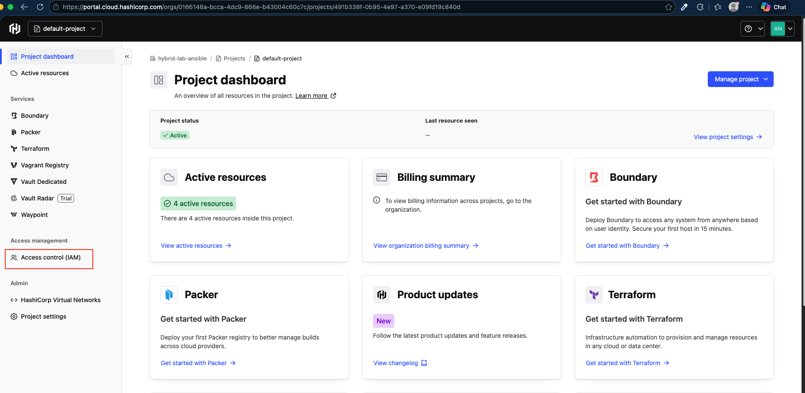
    2. Chọn tab Service principals (ở giữa màn hình).
    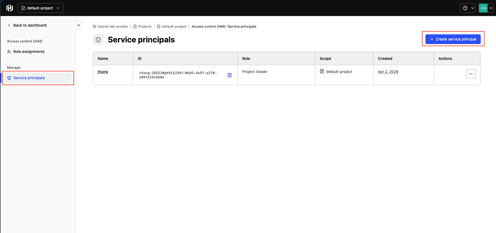
    3. Bấm vào nút "Create service principal" (Đặt tên là terraform-hcp-bot).
    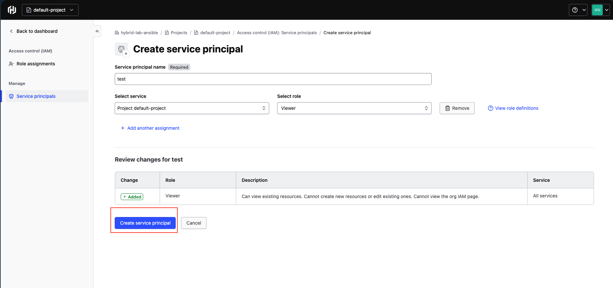
    4. Bấm vào cái tên bạn vừa tạo -> Chọn "Keys" -> Chọn "Create key".
    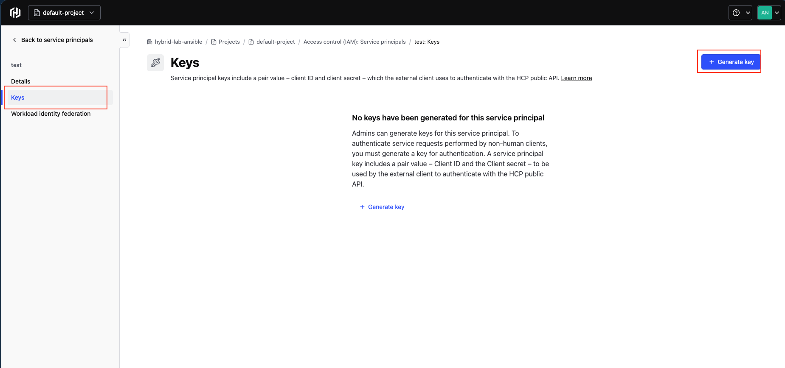
    5. Nó sẽ hiện ra một cái bảng chứa Client ID và Client Secret. (Hãy lưu lại ngay vì nó sẽ ẩn đi sau khi bạn đóng bảng!).
    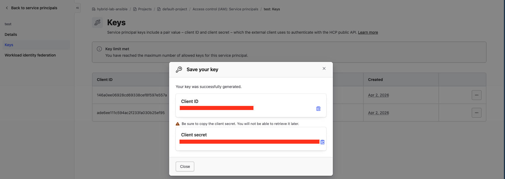

* `TF_VAR_VAULT_TOKEN`: Tại màn hình Dashboard
    1. Chọn `View active resources`
    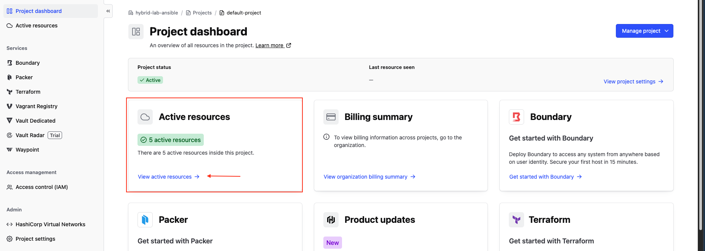
    2. Chọn resource có tên là được tạo ra từ code (e.g: `ansible-vault-cluster`)
    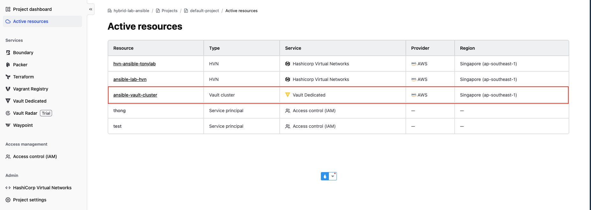
    3. Lưu lại thông tin `Cluster URLs Private`, `Cluster URLs Public`. Tạo token cho admin tại `Generate token`, 
    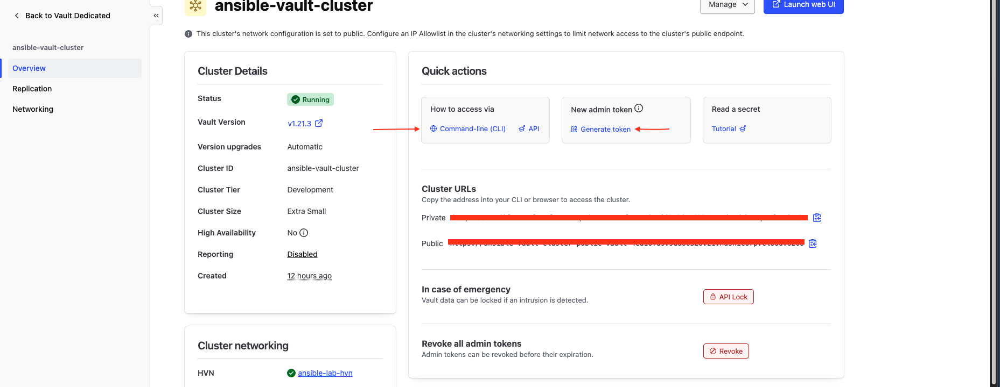
    4. Ấn vào `Command-line` -> `Use public URL` để có các lệnh dùng để có thể đăng nhập `vault`. Rồi dùng CLI để lấy thông tin là `Role ID`, `Secrete Key` của `AppRole` cho Jenkins dùng
    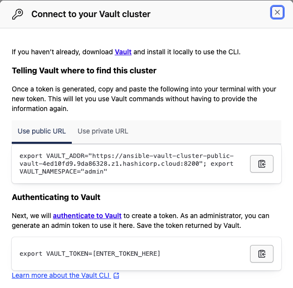
 
---

### GIAI ĐOẠN 2: "Mồi" cấu hình (The Handshake Bootstrap)
* Source code [tại đây](https://github.com/ThongVu1996/ansible-hybrid-lab/blob/main/crete-vault-cluster/main.tf_bk_step_2)
*   **Mục đích:** 
    * Thiết lập "Mối quan hệ tin cậy" giữa Terraform Cloud và Vault. Bạn sẽ hướng dẫn Vault chấp nhận định danh từ Cloud. 
    * Tạo ra được các secret lưu trữ trên HCP Vault
*   **Lưu ý Vàng:** Bạn bắt buộc phải nạp biến môi trường **`TFC_VAULT_PROVIDER_AUTH = false`** để ép Terraform dùng cái "Chìa khóa mồi" (Admin Token) thay vì dùng OIDC (vì OIDC lúc này chưa được kích hoạt).

| Biến (Key) | Loại (Category) | Tính chất | Mô tả |
| :--- | :--- | :--- | :--- |
| `tfc_organization` | terraform | Standard | Tên tổ chức duy nhất của bạn |
| `tfc_workspace` | terraform | Standard | Tên dự án hiện tại |
| `db_password` | terraform | **Sensitive** | Mật khẩu DB cho Laravel |
| `tailscale_key` | terraform | **Sensitive** | Mã Auth cho Tailscale |
| `VAULT_TOKEN` | terraform | **Sensitive** | Admin Token lấy từ Portal |
| **`TF_VAR_VAULT_TOKEN`** | **env** | **Sensitive** | **CHÌA KHÓA MỒI (Token xác thực)** đã được lấy ở giai đoạn 1 |
| `TFC_VAULT_PROVIDER_AUTH` | **env** | Standard | **PHẢI ĐỂ = FALSE** |
| `TFC_VAULT_ADDR` | **env** | Standard | Public URL của Vault |
| `TFC_VAULT_NAMESPACE` | **env** | Standard | Namespace của HCP (`admin`) |
| `TFC_VAULT_RUN_ROLE` | **env** | Standard | Role định danh (`tfc-role`) |

* Kiểm tra secret trên HCP Valut
  1. Đăng nhập vào Launch UI bằng VAULT_TOKEN lấy được ở trên
  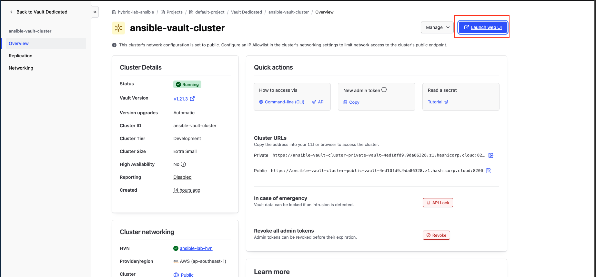
  
  2. Rồi vào `Secrets Engines` rồi check kết quả,sẽ thấy các thông mặc định
  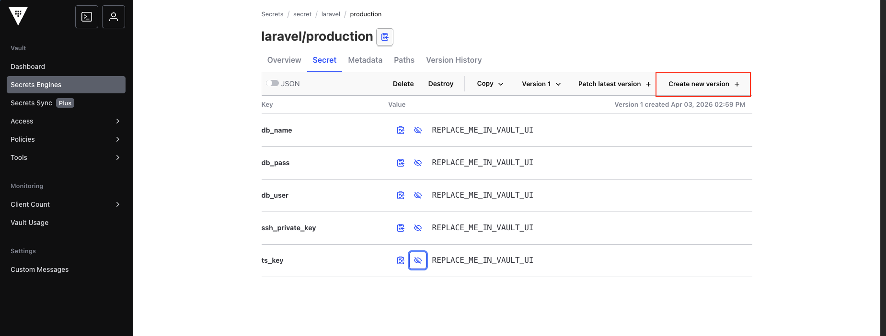
  3. Án vào `Create new version` để tạo giá trị mới cho các biến
  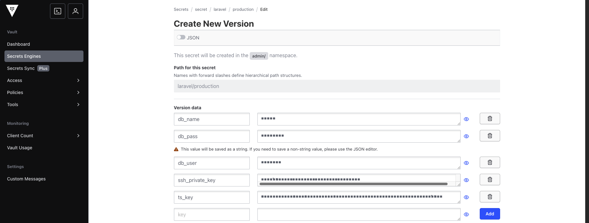
  4. Kiểm tra kết quả đã tạo ra version mới với kết quả đã update thành công
  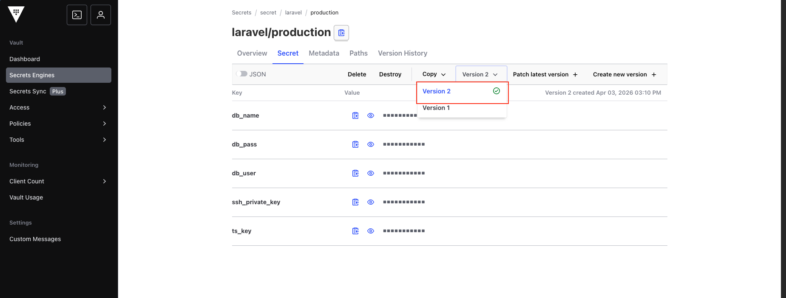

---

### GIAI ĐOẠN 3: Chốt hạ tự động (Final Switchover)
* Source code [tại đây](https://github.com/ThongVu1996/ansible-hybrid-lab/blob/main/crete-vault-cluster/main.tf)
*   **Mục đích:** Loại bỏ hoàn toàn sự phụ thuộc vào Token thủ công. Biến hệ thống của bạn thành một "Cỗ máy tự động" 100%.

*   **Hành động chốt:**
    1. Truy cập mục Variables trên Cloud, **XOÁ BỎ** biến `TF_VAR_VAULT_TOKEN`.
    2. Sửa giá trị biến môi trường `TFC_VAULT_PROVIDER_AUTH` thành **`true`**.
    3. Cập nhật file `.tf`: Loại bỏ dòng `token = var.VAULT_TOKEN` trong phần khai báo Provider.
    4. Chọn `New run` -> `Plan only`, apply chạy nếu thành công là đạt
    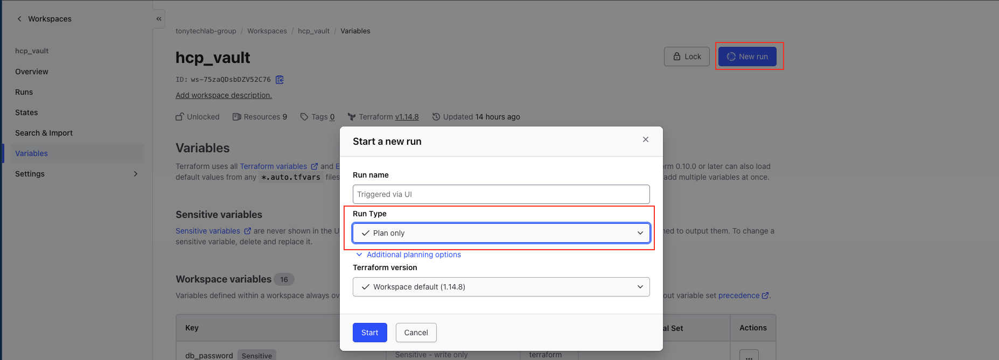
*   **Kết quả:** Mỗi khi chạy Run, Terraform Cloud sẽ tự trình diện Hộ chiếu JWT và Vault sẽ mở cửa đón tiếp vĩnh viễn!

*   **Lấy RoleID/SecretID cho Jenkins (An toàn):**
    1. **Lấy Role ID:** Trong file `main.tf`, có dòng output (Role ID có thể công khai, kết quả chạy run này là ở giai đoạn 2):
       ```hcl
       output "jenkins_role_id" {
         value = vault_approle_auth_backend_role.jenkins.role_id
       }
       ```
       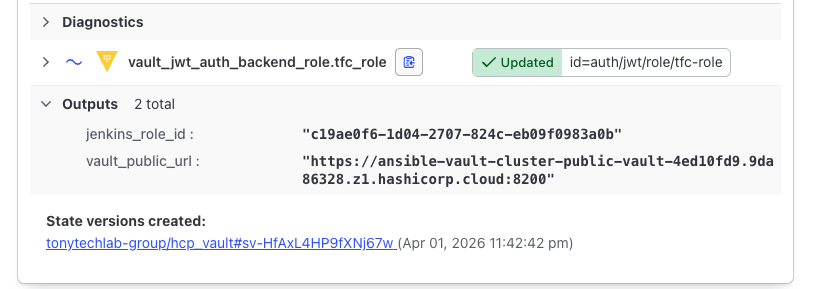
    2. **Lấy Secret ID (Sử dụng CLI):** Không xuất ra màn hình Terraform, hãy dùng lệnh sau để sinh mã dùng 1 lần:
        * Thêm biến môi trường
          ```bash
          export VAULT_ADDR="URL_PUBLIC_CỦA_BẠN"
          export VAULT_NAMESPACE="admin"
          export VAULT_TOKEN="token lấy ở giai đoạn 1"
          ```
        
        * Login vào Vault
          ```bash
            vault login VAULT_TOKEN
          ```

        * Lấy Secret ID
          ```bash
            vault write -f auth/approle/role/jenkins-role/secret-id
          ```
          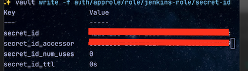

    > Các tham số được sử dụng trong code có thể tham khảo thêm [tại đây](https://registry.terraform.io/providers/hashicorp/vault/latest/docs/resources/approle_auth_backend_role) và [tại đây](https://developer.hashicorp.com/vault/api-docs/auth/approle)
